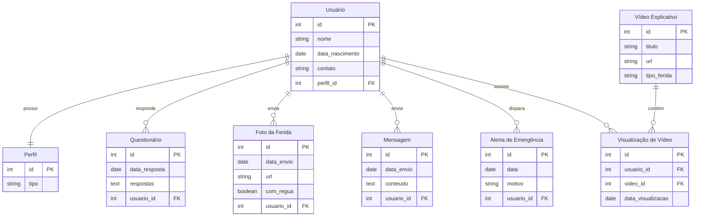

## Introdução

O diagrama tem as seguintes entidades:

-   Usuário: Paciente ou profissional de saúde, definido por perfil_id
    
-   Perfil: Tipo de usuário 
    
-   Questionário: Respostas enviadas pelo paciente
    
-   Foto da Ferida: Imagem enviada pelo paciente
    
-   Mensagem: Mensagens entre o paciente e o médico
    
-   Alerta de Emergência: Acionado caso o paciente não envie atualizações no tempo desejado.
    
-   Vídeo Explicativo: Conteúdo que explica a ferida
    
-   Visualização de Vídeo: Registra se o paciente viu o vídeo.
    

As entidades possuem chaves primárias e estrangeiras para garantir a integridade e o acompanhamento contínuo.
